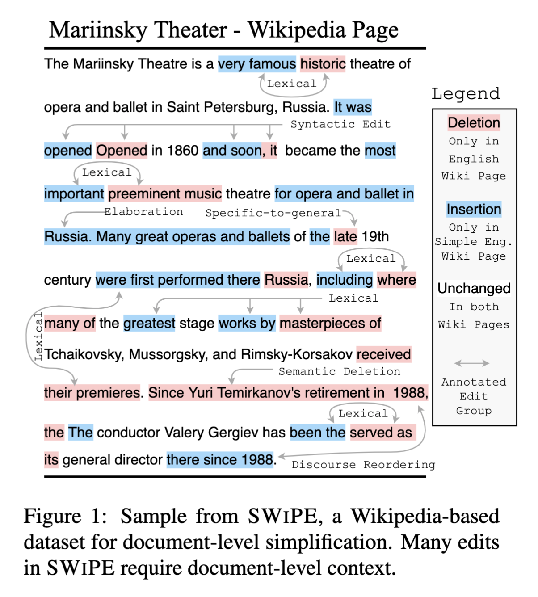

# Document-Level Simplification

This repository contains the code for ACL2023 paper: [SWiPE: A Dataset for Document-Level Simplification of Wikipedia Pages]().

<p align="center">
  
</p>

## The SWiPE dataset

All dataset files are in the [data/](https://github.com/salesforce/simplification/tree/master/data) folder.
We release both the manually annotated portion of the data, which consists of ~5k samples, as well as the full dataset which contains roughly 140k document pairs.

The [SWiPE_Dataset.ipynb](https://github.com/salesforce/simplification/blob/master/SWiPE_Dataset.ipynb) notebook goes over how to load the dataset and process/visualize annotations.

## Models

We release three model cards on the HuggingFace hub:
- [Salesforce/bart-large-swipe](https://huggingface.co/Salesforce/bart-large-swipe): A BART-large model finetuned on the SWiPE dataset which can generate document-level edits.
- [Salesforce/bart-large-swipe-clean](https://huggingface.co/Salesforce/bart-large-swipe-clean): A BART-large model finetuned on the cleaned version of the SWiPE dataset, which can generate document-level edits with a reduced proportion of (undesirable) extraneous information edits. We recommend using this model for future comparisons.
- [Salesforce/bic_simple_edit_id](https://huggingface.co/Salesforce/bic_simple_edit_id): The BIC model, which is a RoBERTa-large model finetuned on the task of edit group identification. BIC achieved the highest performance in our experiments on edit identification, by jointly grouping and categorizing edits using a BIO taggging label-set.

The [Generation_and_Identification.ipynb](https://github.com/salesforce/simplification/blob/master/Generation_and_Identification.ipynb) notebook provides an example of generating simplified text for a Wikipedia page and identifying the edits using the BIC model.

## Generator Data

Outputs from the models included in Section 6 are provided in [data/swipe_generator_data.json](https://github.com/salesforce/simplification/blob/master/data/swipe_generator_data.json).
A notebook explaining how to inspect the data is provided in: [Generation_Data.ipynb](https://github.com/salesforce/simplification/blob/master/Generation_Data.ipynb).

## Cite the work

If you make use of the code, models, or dataset, please cite our paper:
```
@inproceedings{laban2023swipe,
  title={SWiPE: A Dataset for Document-Level Simplification of Wikipedia Pages},
  author={Philippe Laban and Jesse Vig and Wojciech Kryscinski and Shafiq Joty and Caiming Xiong and Chien-Sheng Jason Wu},
  booktitle={Proceedings of the 61th Annual Meeting of the Association for Computational Linguistics},
  volume={1},
  year={2023}
}
```

## Contributing

If you'd like to contribute, or have questions or suggestions, you can contact us at plaban@salesforce.com.
All contributions are welcome!


